# Project Folder Structure Diagram

This diagram visualizes the suggested folder structure for the project.

```mermaid
graph TD
    A[complete-email-solutions] --> B(api);
    A --> C(my-mail-server);
    A --> D(prisma);
    A --> E(web-ui);
    A --> F(emails);
    A --> G[.env];
    A --> H[.env.example];
    A --> I[.gitignore];
    A --> J[package.json];
    A --> K[server.js];
    A --> L[README.md];
    A --> M[ARCHITECTURE.md];
    A --> N[ROADMAP.md];
    A --> O[FOLDER_STRUCTURE.md];

    B --> B1(routes);
    B --> B2(middleware);
    B --> B3(services);
    B --> B4(utils);

    C --> C1(config);
    C --> C2(plugins);

    D --> D1(migrations);
    D --> D2(schema.prisma);

    E --> E1(src);
    E --> E2(public);
    E --> E3(package.json);
    E --> E4(vite.config.ts);
    E --> E5(index.html);

    subgraph Legend
        direction TB
        L1(Folder)
        L2(File)
        style L1 fill:#D3D3D3,stroke:#333,stroke-width:2px
        style L2 fill:#F9F9F9,stroke:#333,stroke-width:1px
    end

    classDef folder fill:#D3D3D3,stroke:#333,stroke-width:2px;
    classDef file fill:#F9F9F9,stroke:#333,stroke-width:1px;

    class A,B,C,D,E,F,B1,B2,B3,B4,C1,C2,D1,E1,E2 folder;
    class G,H,I,J,K,L,M,N,O,D2,E3,E4,E5 file;
```

**Explanation:**

*   **`complete-email-solutions`**: The root directory.
*   **`api/`**: Contains the Express.js backend code.
*   **`my-mail-server/`**: Holds Haraka configuration and custom plugins.
*   **`prisma/`**: Contains the database schema and migration files.
*   **`web-ui/`**: Holds the Vite + React frontend code.
*   **`emails/`**: Default directory for storing raw email files (should be in `.gitignore`).
*   **Root Files**: Configuration files (`.env`, `.gitignore`), package manifests (`package.json`), entry points (`server.js`), and documentation (`README.md`, etc.).

You can view this file on platforms that support Mermaid rendering to see the visual tree.
